# IFT6251

Here is the URL to the course repo: https://github.com/rethread-studio/algorithmic-art-course

## Table of Contents

<!-- vim-markdown-toc GFM -->

- [Dependencies](#dependencies)
- [How-to](#how-to)
- [Experiments](#experiments)
  - [birds](#birds)
    - [Interaction](#interaction)
    - [Running](#running)
  - [particles](#particles)
    - [Interaction](#interaction-1)
    - [Running](#running-1)
  - [triangles](#triangles)
    - [Interaction](#interaction-2)
    - [Running](#running-2)
  - [mandelbrot](#mandelbrot)
    - [Interaction](#interaction-3)
    - [Running](#running-3)
    - [Next Steps](#next-steps)
  - [cloud](#cloud)
    - [Interaction](#interaction-4)
    - [Running](#running-4)
    - [Next Steps](#next-steps-1)

<!-- vim-markdown-toc -->

## Dependencies

- `rust >= 1.83.0`

## How-to

To run the different art experiments:

```bash
cargo run --release --bin <bin-name>
```

where `<bin-name>` is one of:

- `birds`
- `cloud`
- `mandelbrot`
- `particles`
- `triangles`

## Experiments

### birds

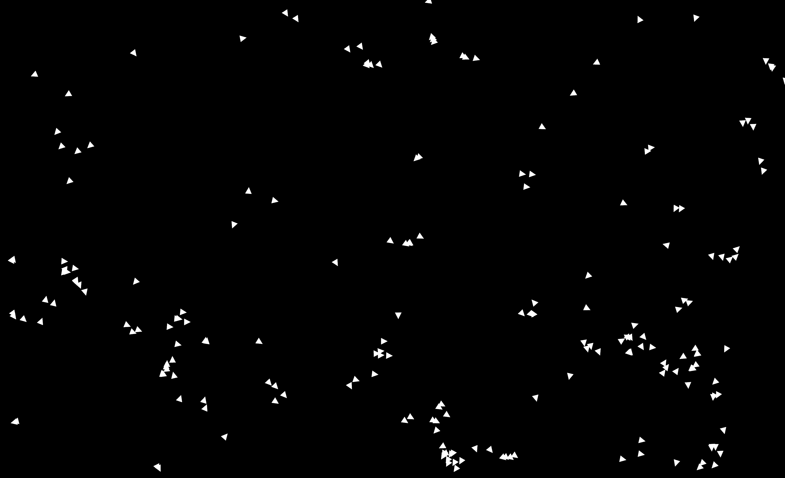

This experiments simply models the flocking behaviour of birds.

#### Interaction

- **`S` Key** → Save the current frame
- **`Q` Key** → Quit

#### Running

You may run the experiment using the following command:

```bash
cargo run --release --bin birds
```

---

### particles

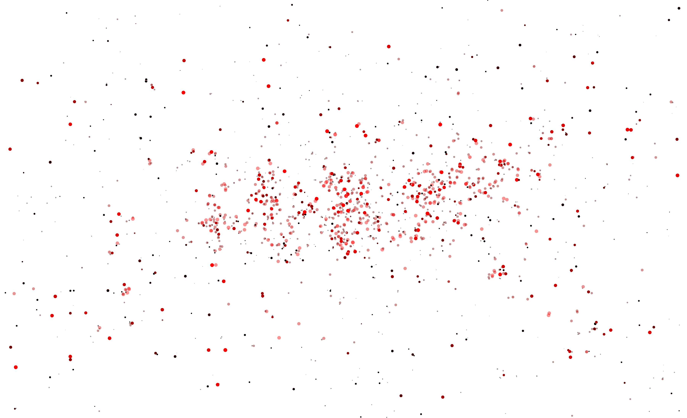

This experiments is a simple particle simulator featuring non-elastic collisions.
Each particle has a mass that changes its color and size.

#### Interaction

- **`S` Key** → Save the current frame
- **`Q` Key** → Quit

#### Running

You may run the experiment using the following command:

```bash
cargo run --release --bin particles
```

---

### triangles

|                                        |                                        |
| :------------------------------------: | :------------------------------------: |
| 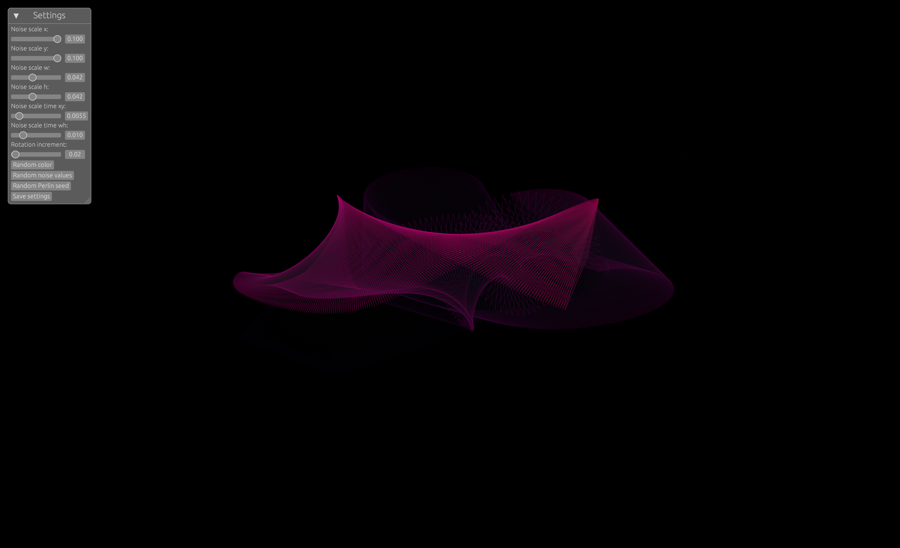 | 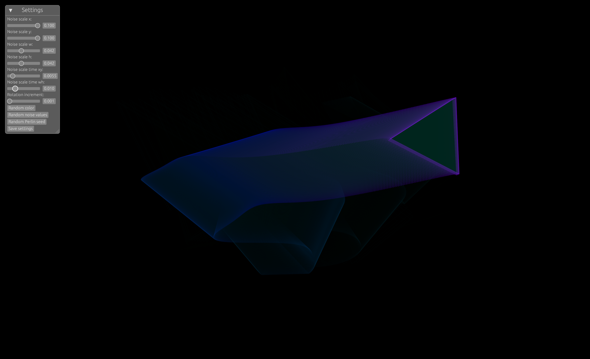 |
| 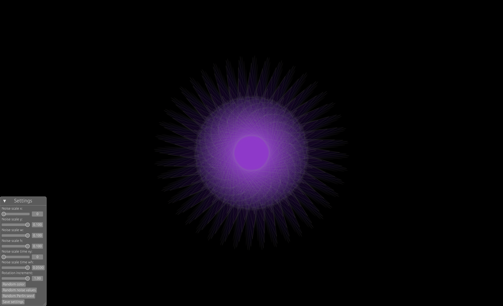 | 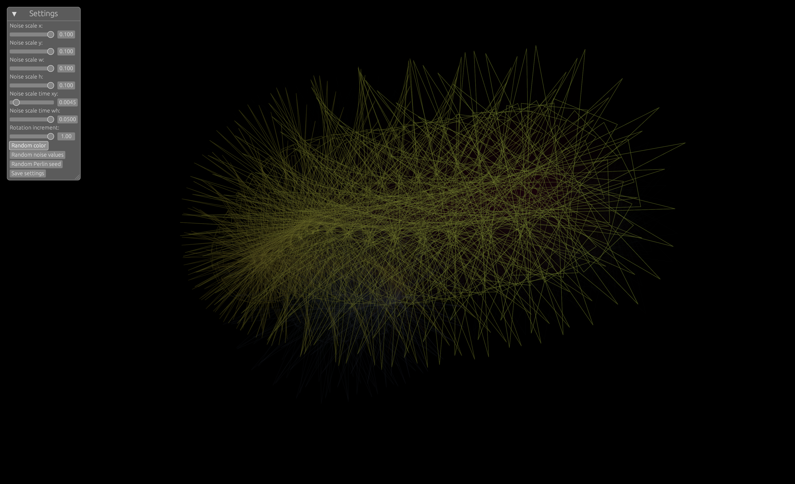 |

For this experimentation, I drew inspiration from two main sources.

The first was [Nikolaus Gradwohl](https://www.local-guru.net/) and one of [his experimentations](https://vimeo.com/492731121). I was captivated by the mesmerizing quality of his animations, especially the way he uses computational techniques to create organic forms and fluid movements.

The second source of inspiration came from January 13th's prompt for [Genuary 2025](https://genuary.art/), created by [Heeey](https://heeey.art): "Triangles and nothing else."

I started with a single triangle as the primitive shape and explored its possibilities by manipulating its position, shape, rotation, and roll using Perlin noise. Inspired by Nikolaus's approach, I introduced the concept of slowly fading triangles to black as more are drawn, and incorporated light, translucent shapes layered over a black background to enhance the ethereal quality of the animation.

A simple, interactive menu that allows for live tweaking of the various noise multipliers and constants used in the code was also implemented, making it easier to explore and experiment with randomness. The menu includes a "Save settings" button, which prints all the current settings to the terminal for easy reference and reuse.

#### Interaction

- **`S` Key** → Save the current frame
- **`Q` Key** → Quit

#### Running

You may run the experiment using the following command:

```bash
cargo run --release --bin triangles
```

---

### mandelbrot

|                                                      |                                                      |
| :--------------------------------------------------: | :--------------------------------------------------: |
| 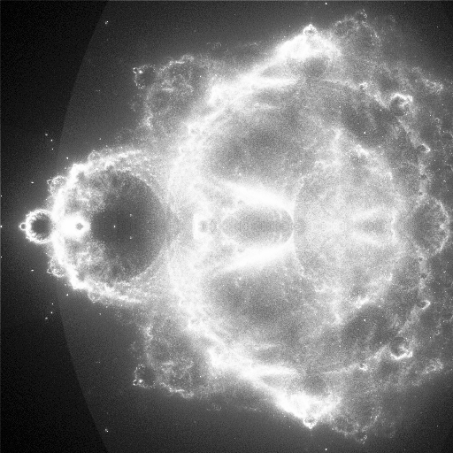 | 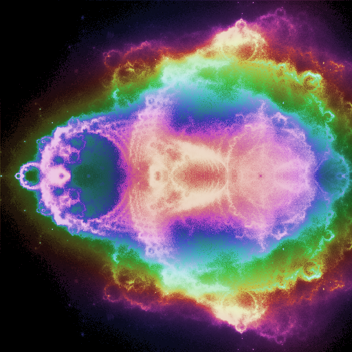 |
| 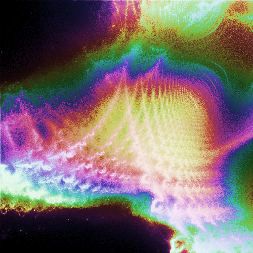 | 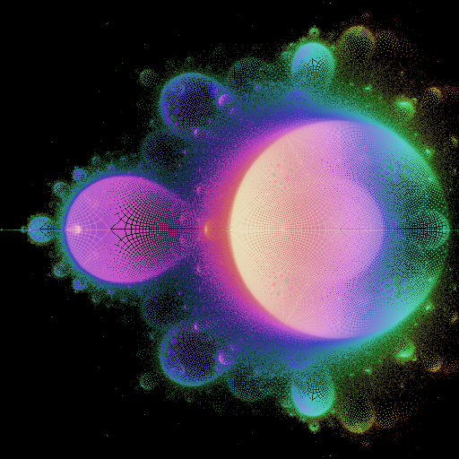 |
| 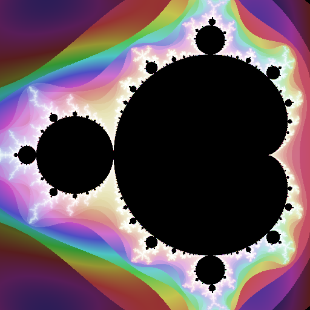 | 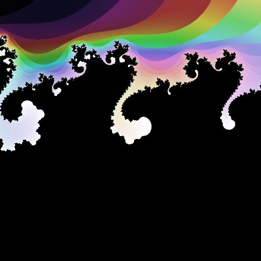 |

For this experiment, I drew inspiration from a simple but profound mathematical theme: **recursion**. The Mandelbrot set is the ultimate recursive fractal; each point in the complex plane is tested against a rule that feeds back into itself, again and again, to determine its fate.

From a single formula, an infinite landscape emerges. This experiment is an invitation to explore recursion visually, to get lost in the infinite depth of the Mandelbrot set, and to uncover new patterns hidden within the chaos.

This experiment is an attempt to not only visualize this fractal but to explore it interactively, manipulating its parameters in real-time and experimenting with alternative ways to render its intricate structure. The project also expands on traditional Mandelbrot rendering by introducing **"subtrajectory" visualization**, a technique that maps each iteration of a complex series back to screen-space, revealing the path of individual points as they evolve.

Another key feature is the ability to **selectively render** either the points **inside** or **outside** the set, offering a different perspective on the fractal’s structure.

#### Interaction

- **Arrow Keys** → Move the viewport
- **`+` / `-`** → Zoom in/out
- **Mouse Scroll** → Zoom dynamically
- **`S` Key** → Save the current frame
- **`Return` Key** → Force redraw
- **`Q` Key** → Quit

#### Running

You may run the experiment using the following command:

```bash
cargo run --release --bin mandelbrot
```

#### Next Steps

The next step would be to write a shader to compute the mandelbrot set for the screen. Right now, the render is only real-time for a low iteration count and low sub-pixel count. Computing the set on the GPU would make the code a lot faster.

### cloud

|                                |                                |
| :----------------------------: | :----------------------------: |
| 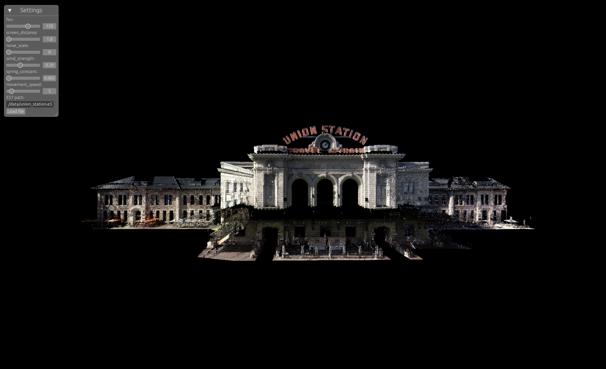 | 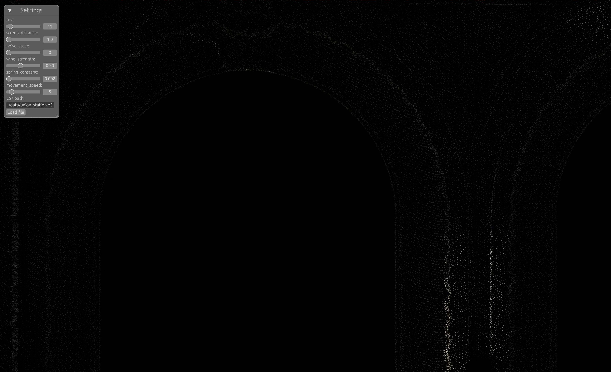 |
| 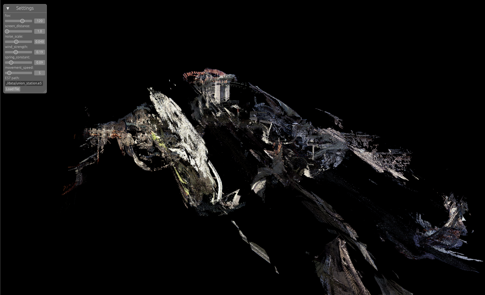 |  |

This experiment is a **point cloud renderer** that utilizes techniques inspired by ray tracing to visualize 3D point clouds on a screen. The simulation introduces **destructive forces** through a Perlin noise wind, which can dynamically **sync with the bass of an audio track**. This synchronization is achieved by computing the **FFT** (Fast Fourier Transform) of the audio buffer in real-time and extracting the amplitude of frequencies below 80Hz. That amplitude multiplies the intensity of the wind.

The noise wind influences the point cloud’s structure, but a **spring-like restorative force** counteracts the displacement. This force is determined by the distance between a point’s displaced position and its original location, causing the cloud to behave similarly to a tree swaying in the wind.

Point clouds can be imported from an `e57` scan, a widely used format for 3D scanning. On iPhones, the _3d Scanner App_ can be used to generate such scans. Otherwise, multiple sites provide `e57` scans for free, such as the "Union Station" scan by _Trimble Inc_ available on [SketchUp](https://help.sketchup.com/en/scan-essentials-sketchup/sample-point-cloud-data)

#### Interaction

The application supports keyboard controls for navigating the camera and adjusting its target. The following keys are available for interaction:

- **Navigation (Moves the camera's position):**
  - `Up Arrow (↑)`: Move forward
  - `Down Arrow (↓)`: Move backward
  - `Left Arrow (←)`: Move left
  - `Right Arrow (→)`: Move right
  - `Period (.)`: Move up
  - `Comma (,)`: Move down
- **Target Adjustment (Moves the camera's focal point):**
  - `W`: Move target forward
  - `S`: Move target backward
  - `A`: Move target left
  - `D`: Move target right
  - `E`: Move target up
  - `Q`: Move target down
- **Exit Application:**
  - `X`: Quit the application

#### Running

You may run the experiment using the following command:

```bash
cargo run --release --bin cloud
```

#### Next Steps

The next step would be to write compute shaders to render the point cloud and to use rasterisation techniques to make the render faster and less CPU intensive.
